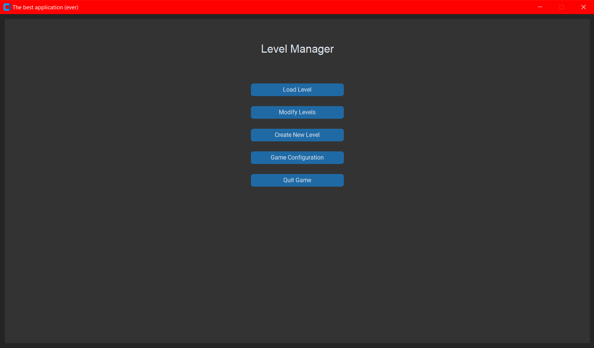
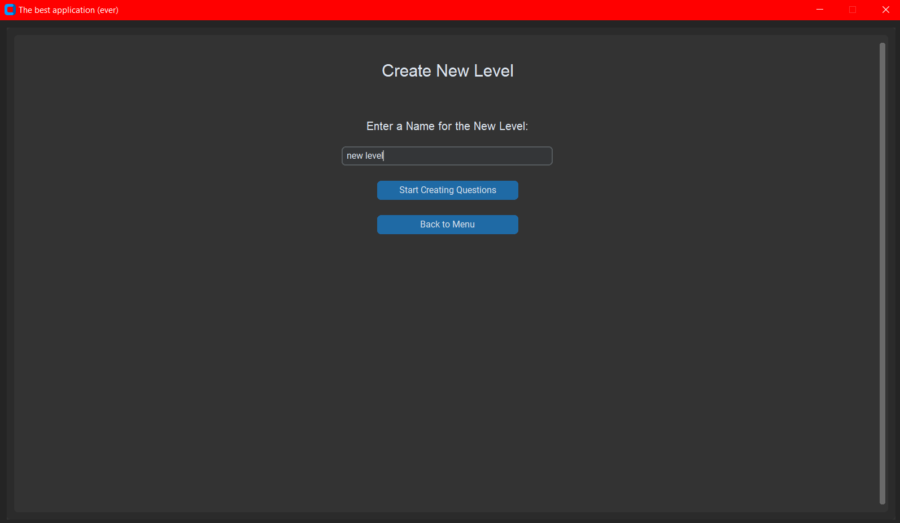
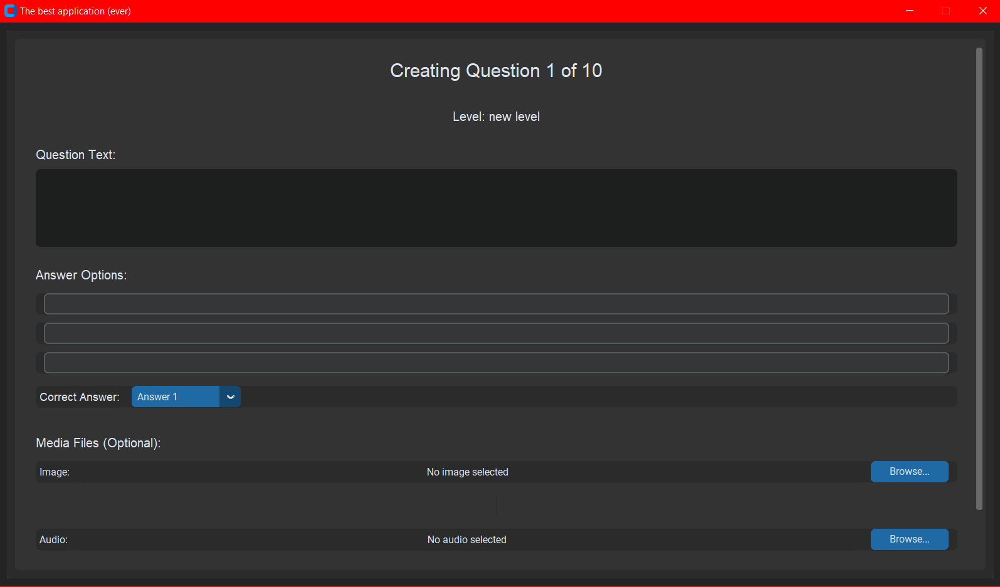
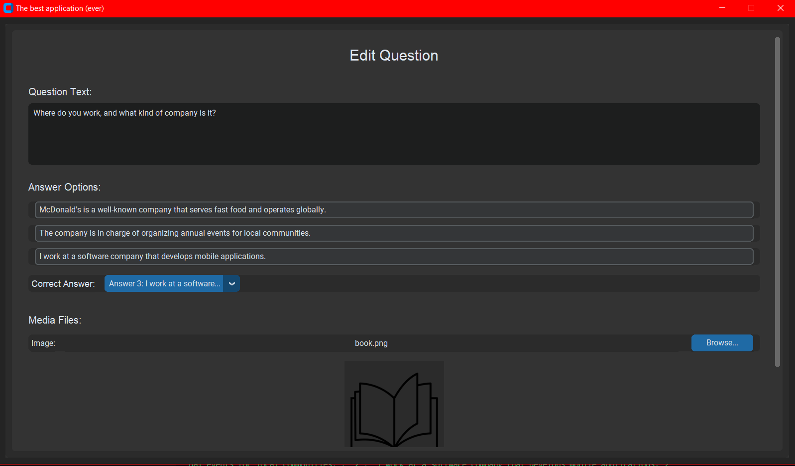
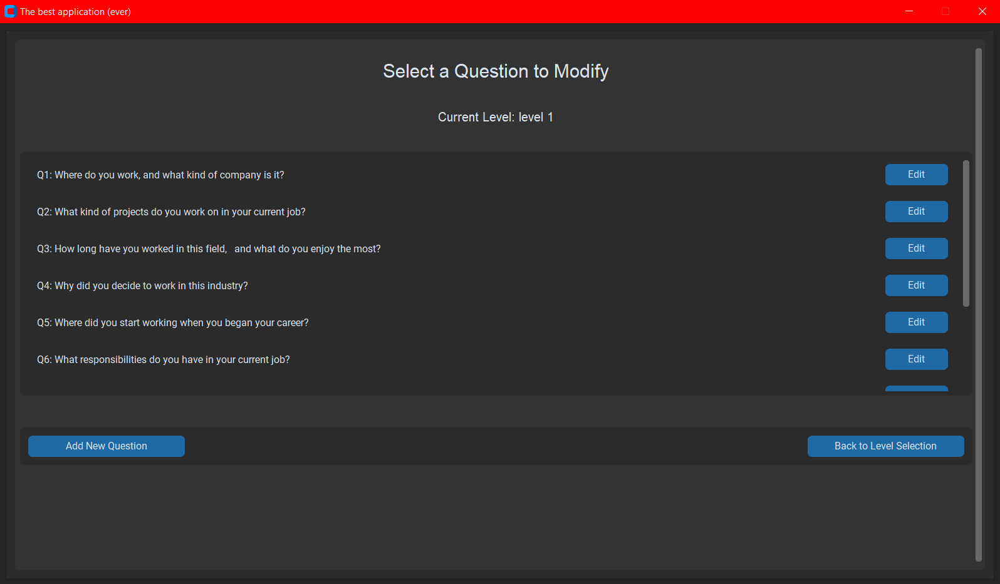
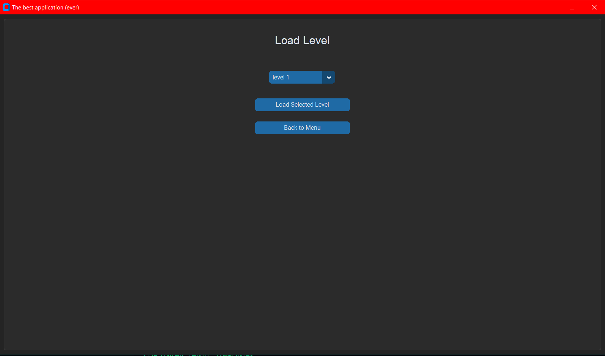
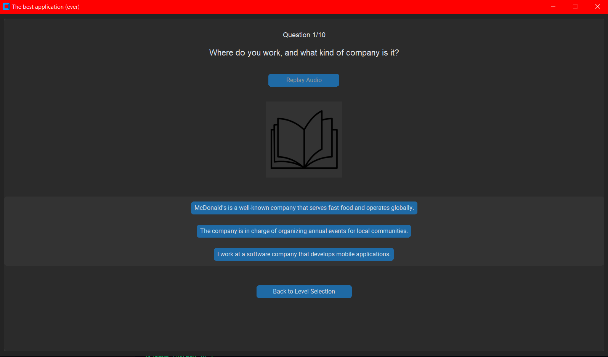
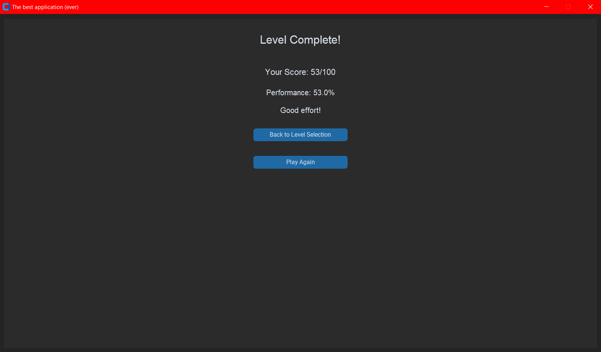
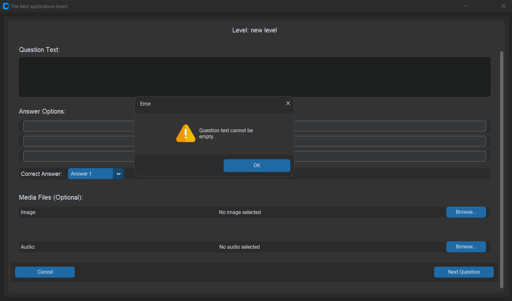

# 🌍 Conversational english serious game


[](https://github.com/TomSchimansky/CustomTkinter)


## 🚀 Overview

An interactive, gamified application designed to make English learning engaging and fun! This quizz based application is designed to help users improve their English vocabulary and grammar skills through a series of questions and answers using both text and audio. The application also includes a custom level creation feature, allowing users to create their own quizzes and share them with others.

## ✨ Features

- 🎮 Engaging Quiz Gameplay
- 📝 Custom Level Creation
- 🔊 Audio Support for Questions
- 🖊️ Question Editor

Based on the screenshots available in the project:

### Main Menu


The application's starting point, providing access to different game modes and options.

### Level Creation


Interface for educators or content creators to develop new learning levels.

### Question Management
- **Creating Questions**: 
  
  
- **Editing Questions**: 
  
  
- **Modifying Questions**: 
  

### Gameplay
- **Loading/Playing Levels**: 
  
  
- **Active Gameplay**: 
  
  
- **Completion Screen**: 
  

### System Notifications


User alerts and warning notifications to guide the user experience.

## 🛠 Technologies Used

- Python 3.8+
- CustomTkinter
- Pygame
- PIL (Python Imaging Library)

## 🔧 Prerequisites

- Python 3.8 or higher
- pip package manager

## 📦 Installation

1. Clone the repository:
```bash
git clone https://github.com/archibald-carrion/Conversational-english-serious-game
cd Conversational-english-serious-game
```

2. Install required dependencies:
```bash
pip install -r requirements.txt
```

## 🎮 How to Run

```bash
python main.py
```

## Development of the Application
### Model-View-Controller (MVC) Architecture
The application is designed using the Model-View-Controller (MVC) architecture, which separates the application into three main components:
- **Model**: Contains the data and logic of the application.
- **View**: Contains the user interface elements of the application.
- **Controller**: Handles user input and updates the model and view accordingly.

